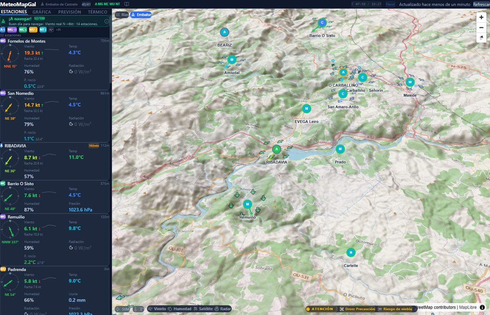

# MeteoMapGal

[](https://github.com/Bateas/MeteoMapGal/releases)
[](LICENSE)
[](src/test/)

**Meteorología en tiempo real para Galicia** — Viento, olas, mareas y alertas con 100+ estaciones, 13 boyas, 13 spots, 19 webcams con IA y mapa 3D interactivo.

**En vivo**: [meteomapgal.navia3d.com](https://meteomapgal.navia3d.com) — Gratuito, sin registro. Funciona en cualquier dispositivo. Instalable como app (PWA).

<p align="center">
  
</p>

---

## Zonas

| Zona | Ubicación | Enfoque |
|------|-----------|---------|
| **Rías Baixas** | Pontevedra (costa) | Viento costero, olas, mareas, 100+ estaciones + 13 boyas |
| **Embalse de Castrelo** | Ourense (interior) | Viento térmico para vela y viticultura, radio 35km |

---

## Cómo usar

1. Abre [meteomapgal.navia3d.com](https://meteomapgal.navia3d.com)
2. Elige zona — Rías Baixas o Embalse
3. Toca un **spot** (icono de navegación) para ver condiciones: viento, olas, veredicto
4. Colores: verde = bueno, amarillo = justo, rojo = peligroso
5. Explora las pestañas: Estaciones, Gráfica, Previsión, Rankings, Historial
6. **Alertas Telegram** — resumen diario 9:00 + alertas instantáneas de cambio de viento
7. **Modo Evento** — selecciona una zona de agua para monitorización de seguridad en tiempo real

> O vento mídese en **nudos (kt)**: 1 nudo = 1,852 km/h. Consulta o glosario na guía para máis info.

---

## Funcionalidades

### Mapa e capas
- Mapa 3D (MapLibre GL) con 6 estilos base + terreo + sombreado
- Partículas de vento animadas, humidade, temperatura, satélite IR, radar
- Cartas náuticas, correntes superficiais, batimetría (só Rías)
- Indicador de frescura nos marcadores (anillo amber >10min, vermello >30min)

### Intelixencia meteorolóxica
- **100+ estacións** de 6 redes (AEMET, MeteoGalicia, Meteoclimatic, WU, Netatmo, SkyX)
- **13 boias mariñas** — ondas, vento, temperatura da auga, correntes
- Consenso de vento ponderado por distancia, frescura, calidade e coherencia direccional
- Detector de tendencias, néboa, frente de racha, afloramento, inversión térmica
- Blacklist de 35 estacións protexidas (validadas con 2 semanas de datos DB)
- Badge de sesgo do modelo na previsión ("Real +3kt" vs Open-Meteo)

### Spots monitorizados (13 spots)

**Vela / Kite (10 spots — hexágono):**
- **Ría de Vigo**: Cesantes, Bocana, Centro Ría, Cíes-Ría, Vao
- **Ría de Pontevedra**: Lourido
- **Ría de Arousa**: A Lanzada, Castiñeiras, Illa de Arousa
- **Embalse**: Castrelo de Miño

**Surf (3 spots BETA — pentágono):**
- Patos, A Lanzada Surf, Corrubedo

**Scoring:**
- Vela: 9 niveles de viento (CALMA → HURACÁN) con marcadores hexágono
- Surf: 5 niveles de oleaje (FLAT / PEQUE / SURF OK / CLÁSICO / GRANDE)
- Transparencia: cada spot muestra las fuentes que contribuyen (nombre, velocidad, peso %)
- Detección térmica con penalización por viento sinóptico
- Ventana de navegación "¿Cuándo salgo?" (48h por spot)
- Mareas por spot (5 puertos IHM)

### Modo Evento / Regata (novo v2.8)
- Selección de zona: 5 zonas OSM reais (Rías + Embalse) ou debuxo libre
- Panel de seguridade: vento IDW interpolado, racha, dirección, tendencia
- Semáforo: SEGURO / PRECAUCION / PELIGRO
- Cronómetro de regata (MM:SS)
- Balizas virtuais arrastrables (A, B, C...)
- Datos marinos: ondas, temperatura auga, mareas IHM
- Avisos AEMET oficiais (CAP XML)
- Timeline 6h con corrección de sesgo do modelo
- Log de seguridade + exportación .txt completa
- Aviación: alertas de aeronaves a baixa altitude

### Alertas intelixentes
- Tormentas (raios <10km = perigo), frentes de vento, cambios bruscos
- Inversión térmica, néboa marítima, mar cruzado, afloramento
- Severidade baseada en puntuación: info (azul) / aviso (amarelo) / alerta (laranxa) / perigo (vermello)
- Inversións e térmicos: cap en amarelo (notables pero non perigosos)
- Validación por usuario (feedback con botóns)
- Telegram 24/7 vía ingestor (resumen diario + alertas instantáneas)

### Marítimo (Rías Baixas)
- Mareas para 5 portos, ondas, néboa marítima
- Información de mareas no ticker
- Detección de augas protexidas (interior ría: suprime datos de ondas Open-Meteo)

### Agricultura
- Alertas de campo (xeada, choiva, néboa, ET0, risco fitosanitario)
- GDD para viticultura (9 fases fenolóxicas)
- Fases lunares, espazos aéreos para drons

### Precursores térmicos (Embalse)
- 6 sinais en tempo real: terral, deltaT, rampla solar, gradiente humidade, diverxencia vento, previsión
- Probabilidade 0-100% con ETA no ticker
- Verificación de prediccións (hit rate 30 días)

---

## Fontes de datos

| Fonte | Datos |
|-------|-------|
| AEMET, MeteoGalicia, Meteoclimatic | Estacións oficiais e cidadás |
| Weather Underground, Netatmo, SkyX | Estacións persoais |
| Puertos del Estado, Obs. Costeiro | Boias mariñas |
| Open-Meteo | Previsión ECMWF/GFS/ICON |
| EUMETSAT, RainViewer, IHM, ENAIRE | Satélite, radar, mareas, espazo aéreo |
| CMEMS, EMODnet, INTECMAR, IGN | SST, batimetría, correntes, cartografía |
| OpenSky Network | Tráfico aéreo (experimental) |
| MeteoGalicia Webcams | 19 cámaras en tempo real (imaxe + Vision IA) |
| Ollama (moondream/llava) | Análise visual de webcams (Beaufort, néboa, ceo) |

Todos os datos de fontes abertas. Só AEMET require chave API gratuíta.

---

## Roadmap

### v2.10 — Actual
- **19 webcams MeteoGalicia**: triángulos no mapa con azimuth, popup con imaxe en vivo
- **Vision IA (Ollama)**: análise automática de webcams cada 15min con moondream/llava
  - Estimación Beaufort 0-7 desde a superficie da auga
  - Detección de néboa, visibilidade, estado do ceo
  - Badge "Vision IA" nos popups de spots e webcams
  - Alertas Telegram automáticas por néboa detectada
- **Modo Evento/Regata**: zonas OSM, panel seguridade, cronómetro, balizas, exportación
- **Aviación**: tráfico aéreo OpenSky, alertas baixa altitude
- **Transparencia de scoring**: fontes por spot, contribucións con peso %
- **Sesgo do modelo**: badge "Real +Xkt" na previsión
- **Frescura visual**: estacións sen datos (>30min) case invisibles, sen frechas
- **Coherencia alertas**: severidade baseada en puntuación, cores unificados
- **Rendimiento**: stagger startup (10s), lazy-load RegattaPanel (-27KB)
- 236 tests, GPU markers 60fps, 19 stores Zustand

### Próximamente
- Novas zonas (A Coruña, Costa da Morte)
- Scoring de praias para turismo
- Modelos vision máis grandes (llava 7B) para mellor detección

### v3.0 — Futuro
- Panel Pro para clubs e escolas
- Hardware propio (ESP32 + anemómetro)
- Modelo ML de predición con datos históricos
- Procesamento vision avanzado: conteo embarcacións, detección temporal

---

## Para desenvolvedores

```bash
git clone https://github.com/Bateas/MeteoMapGal.git
cd MeteoMapGal
npm install
cp .env.example .env    # Engadir chaves API de AEMET + ObsCosteiro
npm run dev             # http://localhost:5173
npm run build           # Produción → dist/
npm test                # 235 tests (Vitest)
```

**Stack**: React 19.2 · TypeScript 5.9 · Vite 7.3 · MapLibre GL 5.19 · Zustand 5 · Tailwind 4.2 · Recharts · TimescaleDB

---

## Apoiar

[](https://ko-fi.com/bateas)

## Licenza

[MIT](LICENSE)

---

<p align="center">
  <sub>Feito en Galicia · Datos abertos · Código aberto</sub>
</p>
