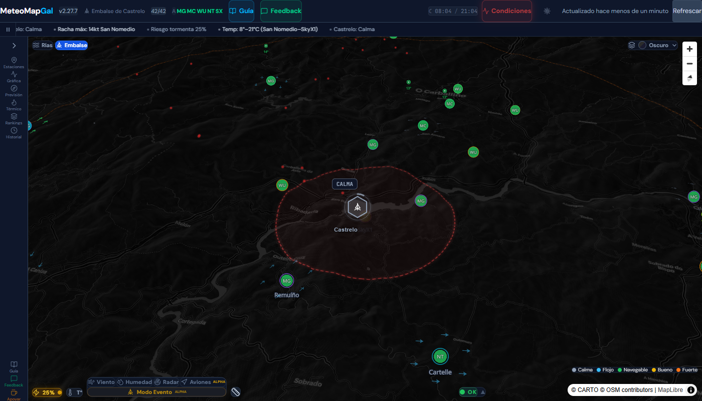
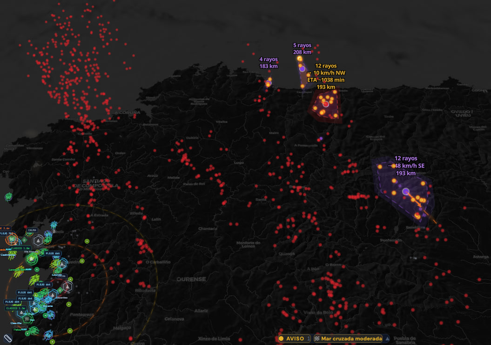
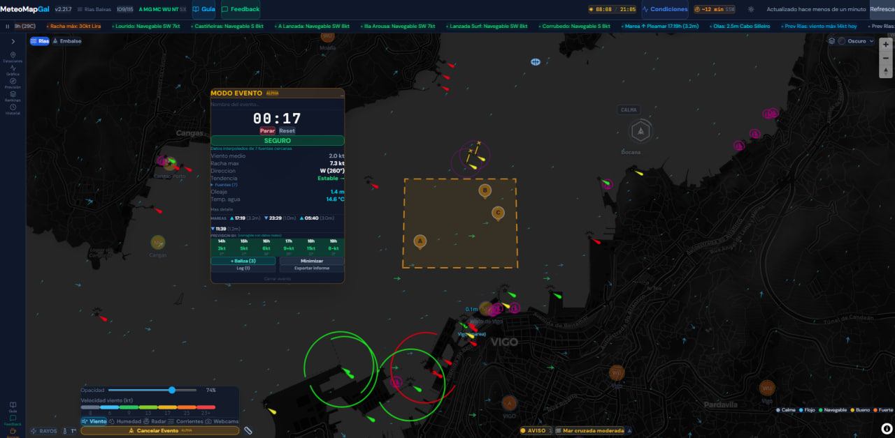
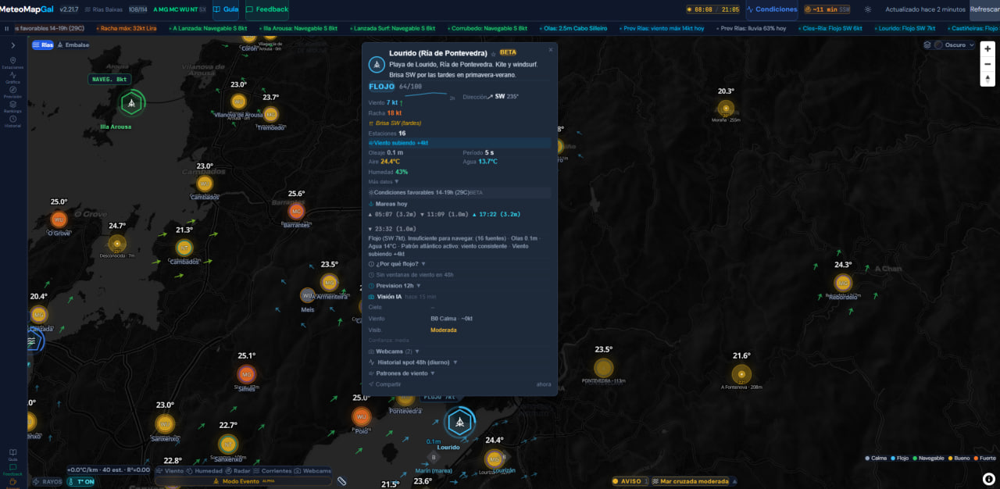
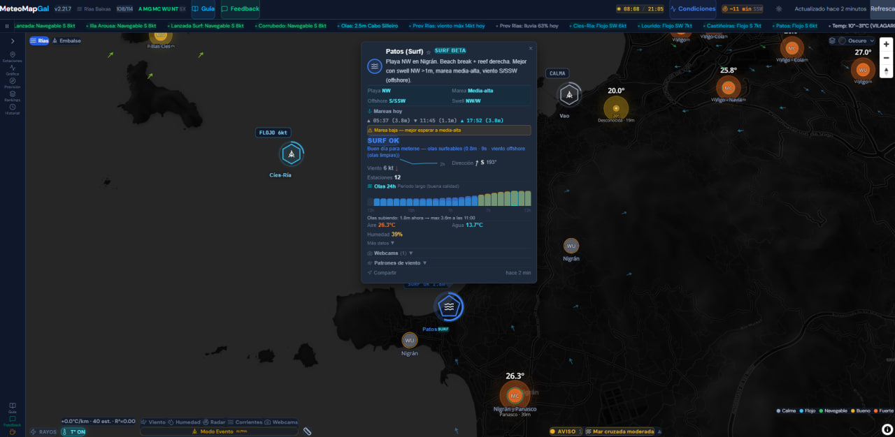
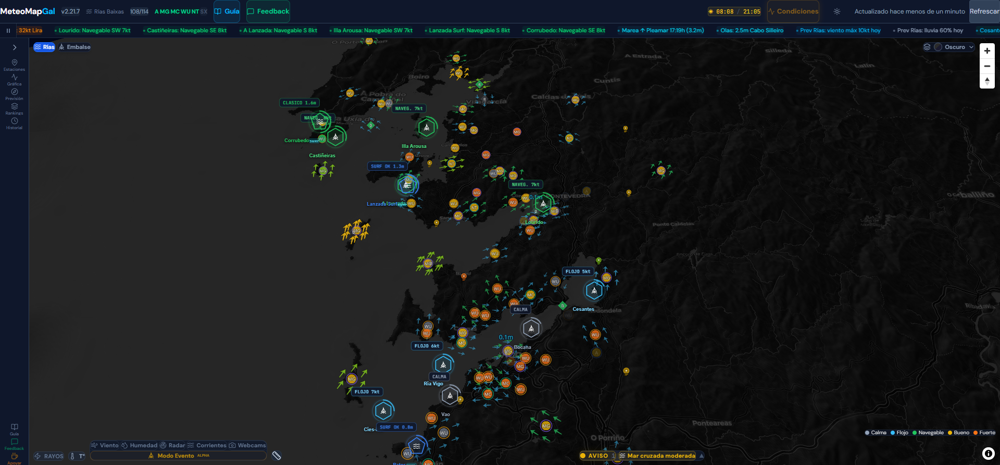

# MeteoMapGal

[](https://github.com/Bateas/MeteoMapGal/releases)
[](LICENSE)
[](src/test/)
[](https://meteomapgal.navia3d.com)

**Meteorologia en tiempo real para deportes acuaticos en Galicia** — Viento, olas, mareas y alertas con 100+ estaciones, 13 boyas, 13 spots monitorizados, 19 webcams con IA y mapa 3D interactivo.

**Pruebalo**: [meteomapgal.navia3d.com](https://meteomapgal.navia3d.com) — Gratuito, sin registro. Funciona en movil y escritorio.

---

<p align="center">
  
</p>

## Para quien es

| Perfil | Que obtiene |
|--------|-------------|
| **Navegantes de vela** | Saber si merece la pena ir al agua. Veredicto instantaneo por spot |
| **Surfistas** | Olas + viento + marea en un vistazo. Factor costero calibrado por playa |
| **Kitesurfistas / Windsurfistas** | Ventana de viento optima en las proximas 48h |
| **Clubs nauticos** | Panel de seguridad para regatas. Semaforo automatico + log exportable |
| **Coordinadores de seguridad** | Modo Evento: zona personalizable, alertas rayos/viento, responsabilidad documentada |
| **Agricultores / Viticultores** | Helada, lluvia, ET0, grados-dia, riesgo fitosanitario |

---

## Zonas

| Zona | Ubicacion | Enfoque |
|------|-----------|---------|
| **Rias Baixas** | Pontevedra (costa) | Viento costero, olas, mareas, surf, 100+ estaciones + 13 boyas |
| **Embalse de Castrelo** | Ourense (interior) | Viento termico para vela, agua plana, radio 35km |

---

## Como usar

1. Abre [meteomapgal.navia3d.com](https://meteomapgal.navia3d.com) en cualquier dispositivo
2. Elige zona — Rias Baixas o Embalse
3. Toca un **spot** (icono hexagonal) para ver condiciones y veredicto
4. Escala de colores: gris = calma, azul = flojo, verde = navegable, amarillo = bueno, naranja = fuerte
5. Explora: Estaciones, Grafica, Prevision, Rankings, Historial
6. **Alertas Telegram**: resumen diario a las 9:00 + alertas instantaneas de cambio de viento
7. **Modo Evento**: selecciona una zona de agua para monitorizar seguridad en tiempo real

> El viento se mide en **nudos (kt)**: 1 nudo = 1,852 km/h.

---

## Funcionalidades principales

### Mapa en tiempo real
- Mapa 3D (MapLibre GL) con 6 estilos base + terreno
- Flechas de viento coloreadas por intensidad en cada estacion
- Capas: humedad, temperatura, radar, webcams, corrientes, cartas nauticas


### Scoring inteligente (13 spots)
- **Vela** (10 spots): 9 niveles de viento (CALMA a HURACAN). Consenso de multiples estaciones ponderado por distancia y calidad
- **Surf** (3 spots BETA): 5 niveles de oleaje (FLAT / PEQUE / SURF OK / CLASICO / GRANDE) con correccion costera por playa y alineamiento del swell
- Cada spot muestra las fuentes que contribuyen al veredicto (nombre, velocidad, peso %)
- Deteccion de patrones locales: termicas, bocanas, virazones de ria
- Ventanas de navegacion: "Cuando salgo?" con prevision 48h


### Seguimiento de tormentas

Deteccion y tracking de nucleos tormentosos en tiempo real, directamente en el mapa:

```
  En el mapa:                        Etiqueta por cluster:

  ● Amarillo  Rayo <15 min           ┌──────────────────────┐
  ● Naranja   Rayo 15-60 min         │ 12 rayos             │
  ● Rojo      Rayo 1-6h              │ → 45 km/h SW         │
  ● Gris      Rayo 6-24h (hist.)     │ ETA ~18 min          │
  ▲ Violeta   Nucleo tormentoso      │ 32 km                │
  → Naranja   Flecha de avance       └──────────────────────┘
  ┄ Punteada  Proyeccion 5-30 min
```

- **Predictor de 8 senales**: CAPE, CIN, lluvia, nubes, rayos, avance, sombra solar, avisos MeteoGalicia
- **Avisos oficiales**: RSS de MeteoGalicia (amarillo/naranja/rojo) integrado en ticker y panel
- **ETA inteligente**: usa la componente de velocidad hacia ti, no la velocidad total
- **Subdivision automatica**: frentes de 100+ km se dividen en clusters manejables

<p align="center">
  
  <br><sub>Nucleos tormentosos: etiquetas on-map (rayos, velocidad, ETA, distancia) + flechas de avance + radar</sub>
</p>

### Modo Evento / Regata
- Zona personalizable (dibujo libre o zonas predefinidas)
- Semaforo automatico: SEGURO / PRECAUCION / PELIGRO
- Alertas integradas: rayos, viento, oleaje, avisos AEMET
- Prevision 6h corregida con datos reales (elimina sesgo del modelo)
- Log de seguridad exportable para federaciones

<p align="center">
  
  <br><sub>Modo Evento: zona de agua, semaforo de seguridad, oleaje, mareas, exportar informe</sub>
</p>

### Alertas 24/7
- Bot Telegram autonomo: cambio brusco, tormentas, oleaje + resumen diario
- Tormentas (rayos <5km = peligro, <25km = aviso, <80km = vigilancia)
- Niebla maritima, frentes de viento, inversiones termicas
- Clasificacion por severidad: info / aviso / alerta / peligro

### Scoring inteligente — popup de spot

<p align="center">
  
  
  <br><sub>Izq: spot de vela (veredicto + viento + fuentes). Der: spot de surf (oleaje + periodo + factor costero)</sub>
</p>

### Datos marinos (Rias Baixas)
- 13 boyas: oleaje, viento, temperatura del agua
- Mareas para 5 puertos (IHM)
- Corrientes superficiales HF radar
- Cartas nauticas oficiales (IHM ENC)

<p align="center">
  
  <br><sub>Sector Rias Baixas: estaciones, boyas marinas, spots de vela y surf</sub>
</p>


### Vision IA (webcams)
- 19 camaras MeteoGalicia analizadas cada 15min
- Estimacion Beaufort 0-7 desde la superficie del agua
- Deteccion de niebla, visibilidad, estado del cielo
- Alertas automaticas por visibilidad reducida


---

## Fuentes de datos

| Fuente | Datos |
|--------|-------|
| AEMET, MeteoGalicia, Meteoclimatic | Estaciones oficiales y ciudadanas |
| Weather Underground, Netatmo, SkyX | Estaciones personales |
| Puertos del Estado, Obs. Costeiro | Boyas marinas |
| Open-Meteo | Prevision ECMWF / GFS / ICON |
| RainViewer, IHM, ENAIRE | Radar precipitacion, mareas, espacio aereo |
| CMEMS, INTECMAR, IGN | SST, corrientes, cartografia |
| MeteoGalicia Webcams + Ollama | 19 camaras + vision IA (Beaufort, niebla) |
| MeteoGalicia Avisos Adversos | Alertas oficiales (tormentas, oleaje, viento) |
| meteo2api (red europea) | Rayos geolocalizados en tiempo real |

> Todos los datos de fuentes abiertas. Solo AEMET requiere clave API gratuita.

---

## Para desarrolladores

```bash
git clone https://github.com/Bateas/MeteoMapGal.git
cd MeteoMapGal
npm install
cp .env.example .env    # Añadir claves API (AEMET + ObsCosteiro)
npm run dev             # http://localhost:5173
npm run build           # Produccion → dist/
npm test                # 282 tests (Vitest)
```

**Stack**: React 19.2 · TypeScript 5.9 · Vite 7.3 · MapLibre GL 5.19 · Zustand 5 · Tailwind 4.2 · Recharts · TimescaleDB

**Arquitectura**:
- Frontend: React SPA con 19 stores Zustand, predictor de tormentas 8 senales, 7 sub-componentes SpotPopup
- Backend: Ingestor Node.js 24/7 → TimescaleDB (polling 6 fuentes cada 5min)
- Produccion: nginx reverse proxy en Proxmox LXC
- WU + Netatmo consolidados via ingestor API (reduce fetches frontend)

---

## Apoyar

[](https://ko-fi.com/bateas)

## Licencia

[MIT](LICENSE) — Codigo abierto. La capa base de datos y seguridad es siempre gratuita.

---

## Sobre o proxecto

> MeteoMapGal nace nas Rias Baixas e no Embalse de Castrelo, de quen navega e coñece o mar galego.
> As ferramentas globais non serven para os microclimas das nosas rias: termicas de val, virazons, bocanas matutinas.
> Este proxecto cruza datos de 100+ estacions, boias e webcams para que o deportista saiba dunha ollada se paga a pena ir a auga.
>
> A capa base de datos e seguridade e sempre de balde. A seguridade dos deportistas non pode estar detras dun muro de pago.
>
> Feito en Galicia. Codigo aberto. Datos abertos.

---

<p align="center">
  <sub>Feito en Galicia · Datos abertos · Codigo aberto</sub>
</p>
