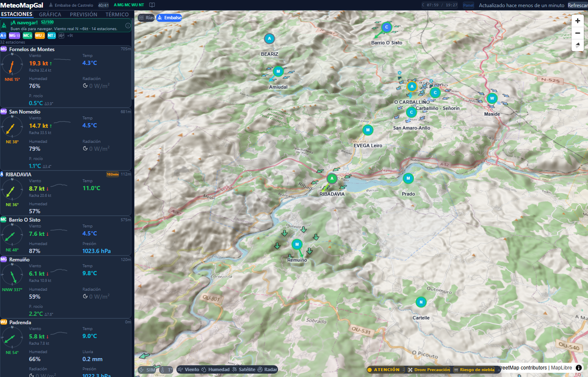

# 🌊 MeteoMapGal

**Meteo interactivo para Galicia** — 41 estaciones en tiempo real, mapa 3D, análisis térmico y más.

<!-- TODO: Añadir screenshot principal aquí -->
<!--  -->

---

## ✨ Qué es

MeteoMapGal es una app de monitorización meteorológica en tiempo real para **Galicia**, con foco en el análisis de viento térmico para navegación a vela en el **Embalse de Castrelo de Miño** y monitorización costera en las **Rías Baixas**.

Agrega datos de **5 redes de estaciones**, modelos numéricos, satélite, radar, mareas y espacio aéreo en una interfaz unificada e interactiva.

## 🗺️ Funcionalidades

| | Funcionalidad | Descripción |
|---|---|---|
| 🌬️ | **Viento en tiempo real** | 41 estaciones con consenso multi-estación, tendencia y coherencia entre zonas |
| 🗺️ | **Mapa 3D interactivo** | MapLibre GL con terreno 3D, partículas de viento, heatmap de humedad |
| ⛵ | **Briefing de navegación** | Score 0-100 con veredicto GO/Marginal/No-Go basado en consenso real |
| 🌡️ | **Perfil atmosférico** | CAPE, BLH, CIN, Lifted Index para evaluación de térmicas |
| 🛰️ | **Satélite IR** | Imagen infrarroja EUMETSAT actualizada cada 15 min |
| 📡 | **Radar de precipitación** | AEMET Cuntis con animación temporal |
| ⚡ | **Rayos** | Detección en tiempo real con alertas por proximidad |
| 🌊 | **Mareas** | Predicciones IHM para 5 puertos de Rías Baixas |
| 🚁 | **Espacio aéreo** | Zonas UAS y NOTAMs de ENAIRE con veredicto para drones |
| 🍇 | **Panel Campo** | Riesgo fitosanitario (mildiu/oídio) y evapotranspiración para riego |
| 📊 | **Gráficos 24h** | Series temporales con exportación CSV |
| 📱 | **PWA** | Instalable, funciona offline con caché de datos |

## 📸 Capturas

<!-- TODO: Capturas de la app en producción -->
<!--
<p align="center">
  
  
</p>
-->

*Capturas próximamente — la app está en fase beta.*

## 🚀 Quick Start

```bash
# Clonar e instalar
git clone https://github.com/TU_USUARIO/meteomapgal.git
cd meteomapgal
npm install

# Configurar API key de AEMET (obligatoria)
cp .env.example .env
# Editar .env con tu clave de https://opendata.aemet.es

# Desarrollo
npm run dev       # http://localhost:5173

# Producción
npm run build     # dist/ con assets hasheados
npm test          # 159 tests con Vitest
```

## 🔧 Tech Stack

| Tecnología | Uso |
|---|---|
| React 19 + TypeScript 5.9 | UI con tipado estricto |
| Vite 7 | Build tool + HMR + proxy CORS |
| MapLibre GL JS 5 | Mapa 3D con terreno |
| Zustand 5 | Estado global (9 stores) |
| Tailwind CSS 4 | Estilos utility-first |
| Recharts | Gráficos de series temporales |
| Vitest | 159 tests unitarios |

## 📡 Fuentes de datos

Todos los datos provienen de **fuentes abiertas y públicas**:

| Fuente | Tipo | Datos |
|---|---|---|
| **AEMET** OpenData | Estaciones oficiales | 9 estaciones, radar Cuntis |
| **MeteoGalicia** | Red autonómica | 13 estaciones, rayos |
| **Meteoclimatic** | Red ciudadana | 6 estaciones |
| **Weather Underground** | Estaciones personales | 1 estación |
| **Netatmo** | IoT doméstico | 11 estaciones |
| **Open-Meteo** | Modelo numérico | Previsión ECMWF/GFS + perfil atmosférico |
| **EUMETSAT** | Satélite | Imagen IR Meteosat |
| **IHM** | Mareas | 5 puertos Rías Baixas |
| **ENAIRE** | Espacio aéreo | Zonas UAS + NOTAMs |

## 🏗️ Estructura

```
src/
├── api/           # Clientes API (9 fuentes)
├── components/    # UI (map, dashboard, charts, guide, layout)
├── config/        # Constantes, zonas térmicas, sectores
├── hooks/         # Custom hooks (weather, thermal, forecast...)
├── services/      # Lógica de negocio (scoring, alertas, IDW...)
├── store/         # Zustand stores (9 stores)
└── types/         # TypeScript types
```

## 🌐 Despliegue

Producción en nginx reverse proxy (Proxmox LXC). Ver `nginx.conf` para configuración de rutas CORS proxy y headers de seguridad.

```bash
npm run build
# Copiar dist/ al servidor
```

## 📄 Licencia

[MIT](LICENSE) — Software libre. Usa, modifica y distribuye sin restricciones.

## ☕ Apoyar el proyecto

Si MeteoMapGal te resulta útil, puedes apoyar su desarrollo:

<!-- TODO: Enlace Ko-fi / Buy Me a Coffee -->
<!-- [](https://ko-fi.com/TU_USUARIO) -->

*Enlace de donaciones próximamente.*

---

<p align="center">
  <sub>Hecho con 🌬️ en Galicia · Datos abiertos · Código abierto</sub>
</p>
