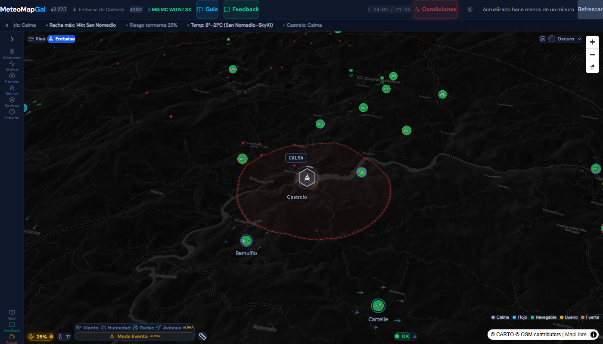
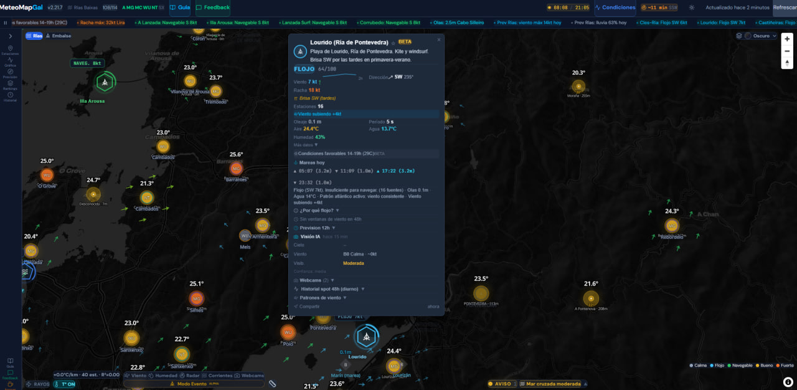
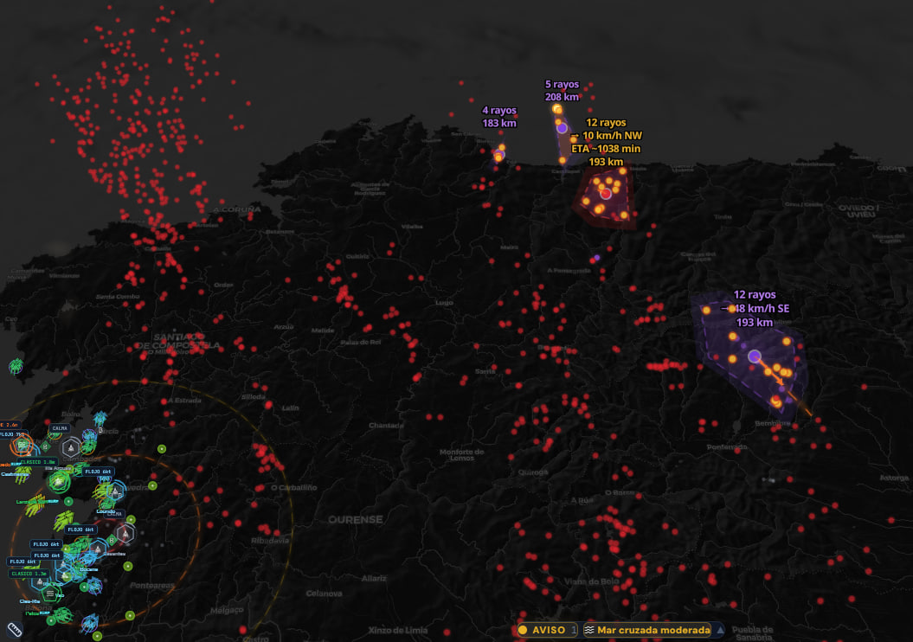

# MeteoMapGal

[](https://github.com/Bateas/MeteoMapGal/releases)
[](https://github.com/Bateas/MeteoMapGal/actions/workflows/ci.yml)
[](LICENSE)

**El tiempo en el agua, en Galicia, en tiempo real.** Viento, olas, mareas, lluvia y tormentas para quien navega, hace surf, kite o windsurf: abres el mapa y en medio minuto sabes si salir, volver o ponerte a cubierto.

**[meteomapgal.com](https://meteomapgal.com)** · Gratis, sin registro, en el móvil y en el ordenador.

<p align="center">
  
</p>

---

## Qué resuelve

Los modelos globales no ven los microclimas de las rías ni del interior: la brisa térmica de un valle, el viento que entra por la bocana a primera hora, la ensenada que canaliza. MeteoMapGal cruza más de **400 estaciones**, **13 boyas**, **21 webcams** y los modelos de MeteoGalicia, y lo resume **spot a spot** en un veredicto que se entiende de un vistazo.

| Zona | Dónde | Para qué |
|---|---|---|
| **Rías Baixas** | Costa de Pontevedra | Viento costero, olas, mareas, surf |
| **Embalse de Castrelo** | Interior de Ourense | Brisa térmica para vela en agua plana |

---

## Qué ves en el mapa

**Veredicto por spot.** Cada uno de los 14 spots dice cómo está ahora: de CALMA a FUERTE para vela, y de FLAT a GRANDE para surf (3 playas). El viento sale del consenso de las estaciones cercanas, pesadas por su exposición real, y la ficha enseña de dónde sale cada cifra.

**Lluvia ahora.** Cuando llueve, el mapa pinta dónde, con qué intensidad y hacia dónde va. El radar dibuja la zona; los pluviómetros confirman que llega al suelo, y el eco débil que desmienten no se pinta. Con tiempo seco no aparece.

**Tormentas y rayos.** Rayos en tiempo real, núcleos con su rumbo y su velocidad, y un aviso de seguridad específico para tu spot cuando caen rayos cerca. Desde la ficha puedes pedir una notificación si se acerca una tormenta.

**Avisos que importan.** Avisos oficiales de MeteoGalicia en el mapa, con lo que significa un aviso naranja para el deporte (los umbrales de ola y viento de la Xunta), niebla localizada, calidad del aire, UV alto, aguas vivas y focos de incendio. Solo aparecen cuando cambian lo que vas a hacer.

**Mar.** Boyas con ola, periodo, viento y temperatura del agua; mareas por puerto; oleaje cerca de costa (SWAN) y cartas náuticas oficiales.

**Previsión.** WRF de 1 km de MeteoGalicia en la celda de cada spot, tabla de 48 h y las mejores ventanas para salir.

**Tu propio spot.** Pon una chincheta donde quieras y la app la puntúa con las estaciones del entorno, marcada «sin calibrar» hasta que se valide.

**Modo simple.** Un botón deja solo lo esencial: spots, previsión y avisos.

<p align="center">
  
  
</p>

---

## Un dato en el que fiarse

- **Calibrado contra el mar.** Cada estación se compara con la boya de su zona, dirección a dirección, para saber cuánto la abriga el terreno. Ese factor corrige su lectura.
- **Sensores rotos, fuera.** Un anemómetro parado deja de contar, y una estación que se aparta mucho de sus vecinas pesa menos.
- **Dos pruebas para avisar.** Ninguna alerta sale de una sola señal: lluvia, niebla o viento brusco necesitan dos fuentes independientes y una comprobación física (con sol fuerte no se anuncia lluvia).
- **Lo que viene del modelo se dice.** La ola en la playa es modelo y la ficha lo indica.
- **Verdad de campo.** Desde la ficha, quien está en el agua puede decir si coincide con lo que ve. Esas respuestas sirven para comprobar la app; no se muestran en el mapa.

## Alertas 24/7

Bot de Telegram con resumen diario a las 9:00, cambios de viento por spot, tormentas cercanas y vigilancia de rayos secos (riesgo de incendio). De noche guarda silencio salvo peligro.

---

## Fuentes de datos

| Fuente | Qué aporta |
|---|---|
| AEMET, MeteoGalicia, IPMA | Estaciones oficiales y avisos |
| Meteoclimatic, Weather Underground, Netatmo | Estaciones de aficionados |
| Puertos del Estado, Observatorio Costeiro da Xunta | Boyas y mareógrafos |
| MeteoSIX (MeteoGalicia) | WRF 1 km, oleaje USWAN, temperatura del mar MOHID |
| MeteoGalicia | Rayos, avisos adversos, calidad del aire, webcams |
| CESGA | Oleaje SWAN cerca de costa |
| Instituto Hidrográfico de la Marina | Mareas y cartas náuticas |
| RainViewer | Radar de precipitación |
| Open-Meteo | Inestabilidad atmosférica (CAPE, LI) |
| NASA FIRMS, Copernicus EFFIS | Focos e incendios activos |
| ENAIRE, IGN, Copernicus Marine, OpenSeaMap | Espacio aéreo, cartografía, temperatura del mar, balizamiento |

Cada fuente se cita en la app con su licencia. Algunas necesitan clave gratuita (AEMET, MeteoSIX, Observatorio Costeiro); se usan solo en el servidor.

---

## Desarrollo

```bash
git clone https://github.com/Bateas/MeteoMapGal.git
cd MeteoMapGal
git config core.hooksPath .githooks      # obligatorio: los tests fallan sin los filtros
npm install
npm rebuild esbuild --foreground-scripts --ignore-scripts=false
npm run dev                               # http://localhost:5173
npx vitest run                            # tests
npm run build                             # producción en dist/
```

**Stack:** React 19 · TypeScript · Vite · MapLibre GL · Zustand · Tailwind · Recharts. Servicio Node.js 24/7 que recoge las fuentes cada 5 minutos en TimescaleDB y sirve la API propia.

Este repositorio es público y se protege a sí mismo: un `.gitignore` en lista cerrada, y filtros en cada commit, en cada push y en CI contra datos privados (`tools/security-scan.sh`). `npm install` no ejecuta scripts de instalación de terceros (`.npmrc`), y las dependencias nuevas esperan siete días antes de entrar.

---

## Qué hay aquí y qué no

Todo el código está en este repositorio: la aplicación, el servicio de datos, los detectores y el método de calibración de estaciones (`src/config/stationBiases.ts`).

Lo que no está son **las mediciones**: la tabla de factores calibrados y el histórico que la produce viven en la base de datos. No son configuración que se copie, son meses de observación continua de la red gallega. Quien clone esto tiene el método completo; las medidas se ganan midiendo.

## Apoyar

[](https://ko-fi.com/bateas)

## Licencia

[MIT](LICENSE). La capa básica de datos y seguridad es y será gratuita.

---

> **Sobre o proxecto.** MeteoMapGal nace nas Rías Baixas e no Embalse de Castrelo, de quen navega e coñece o mar galego. As ferramentas globais non ven os microclimas das nosas rías: térmicas de val, virazóns, bocanas matutinas. A seguridade de quen está na auga non pode estar detrás dun muro de pago.
>
> Feito en Galicia · Código aberto · Datos abertos.
