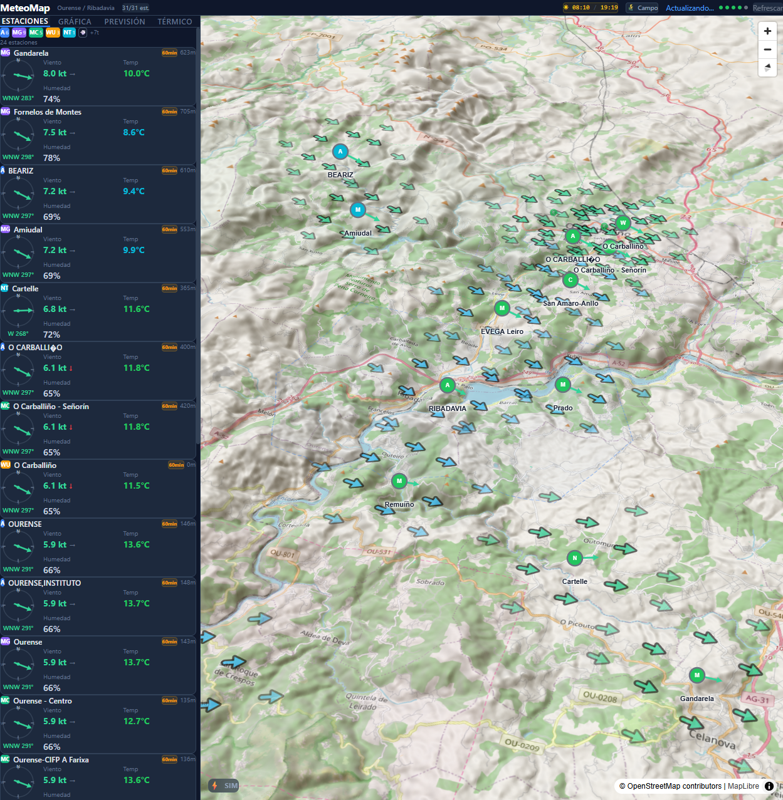
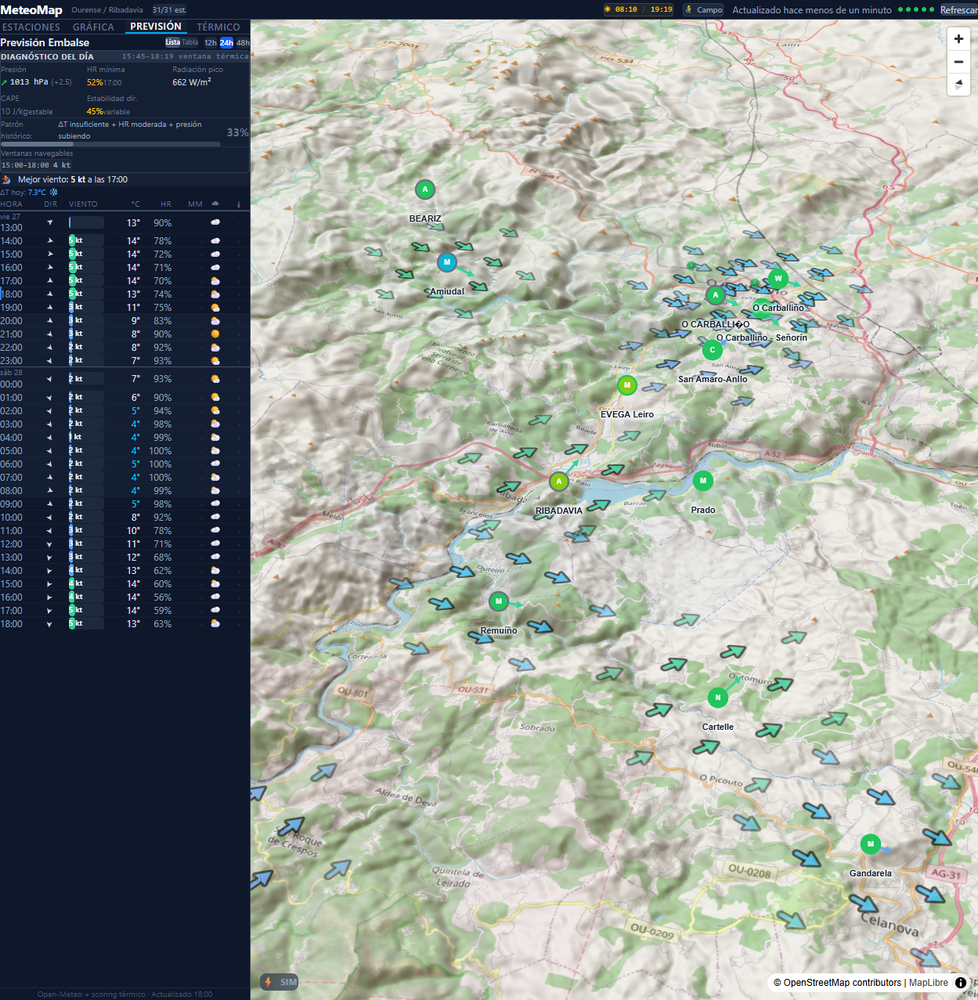
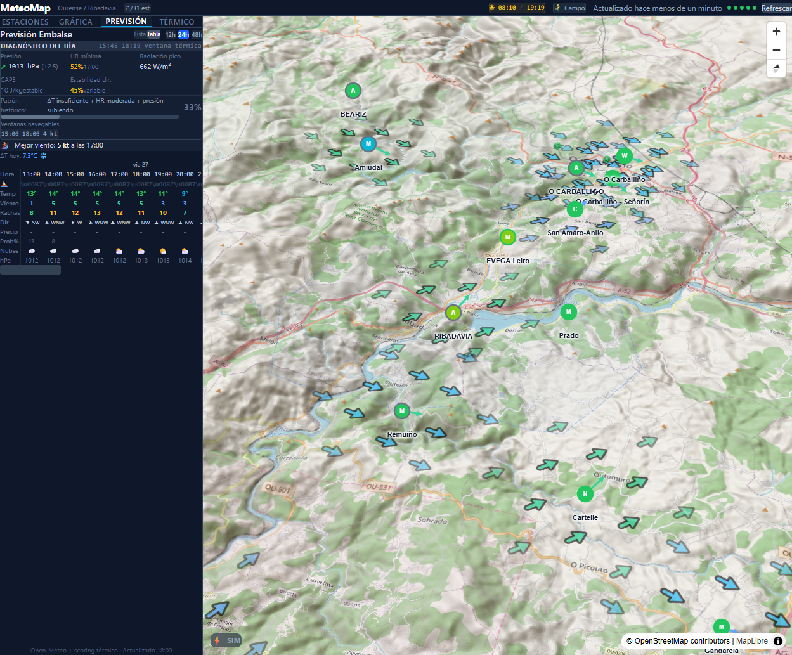
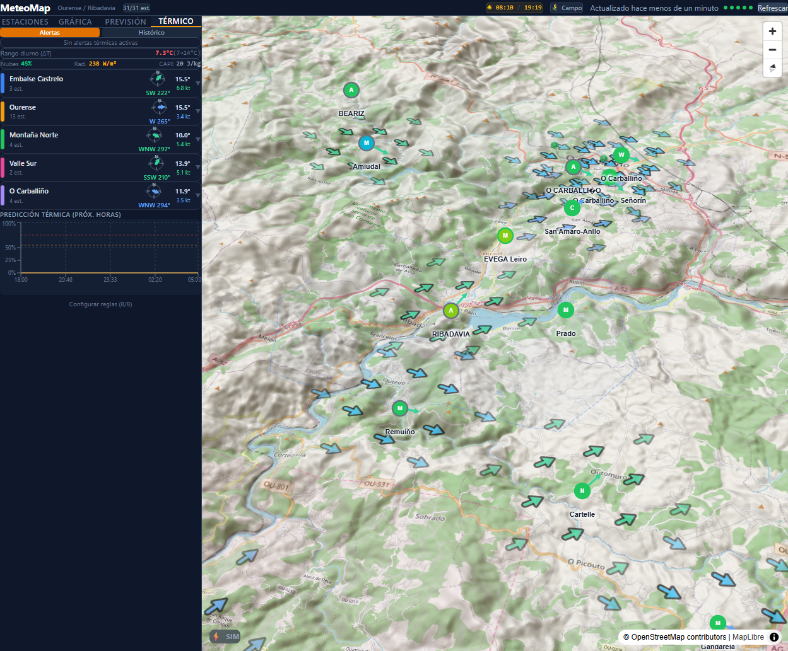
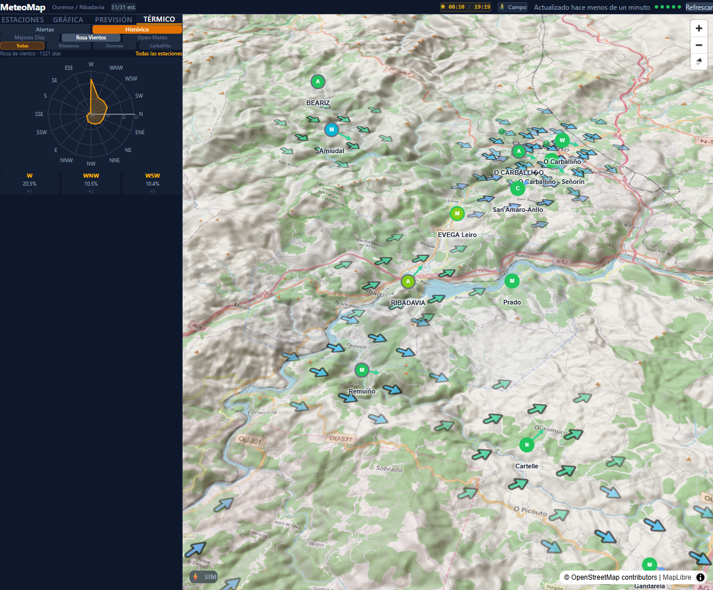
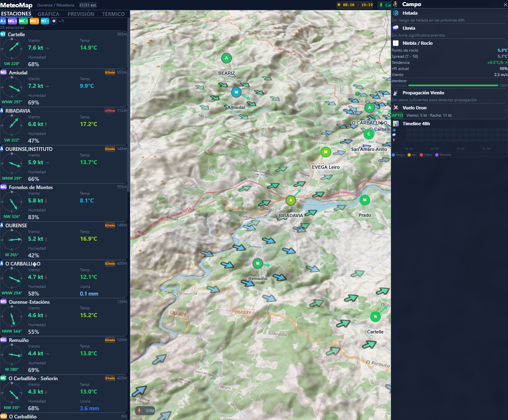
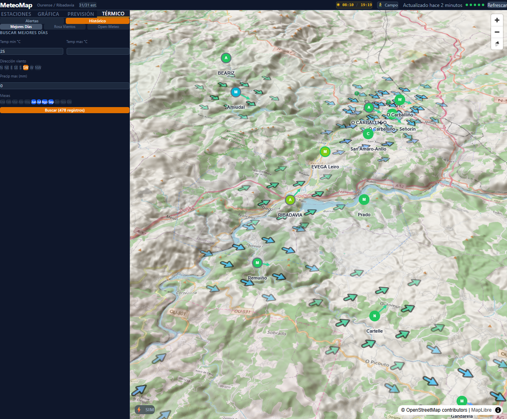

# MeteoMap - Guia Rapida

**Aplicacion de monitoreo meteorologico en tiempo real para la zona de Ourense / Ribadavia (Galicia)**

MeteoMap agrega datos de 5 fuentes meteorologicas diferentes (AEMET, MeteoGalicia, Meteoclimatic, Weather Underground y Netatmo) en un mapa 3D interactivo. Esta orientada al analisis de viento termico para navegacion a vela en el Embalse de Castrelo de Mino, alertas agricolas para viñedo/huerta, y seguimiento de tormentas con rayos en tiempo real. Actualiza datos cada 2 minutos automaticamente.

---

## 1. Vista Principal — Estaciones

La pantalla principal muestra:

- **Mapa 3D** con terreno real (MapLibre GL) centrado en Ribadavia
- **Flechas de viento** sobre el mapa indicando direccion e intensidad (coloreadas por escala Beaufort)
- **Panel lateral izquierdo** con la lista de estaciones ordenadas por velocidad de viento (mayor a menor)
- **Header** con:
  - Contador de estaciones activas (ej. "31/31 est.")
  - Horario solar (amanecer/atardecer)
  - Boton **Campo** para alertas agricolas
  - Indicador de ultima actualizacion

**Cada estacion muestra:**
- Fuente de datos (A=AEMET, MG=MeteoGalicia, MC=Meteoclimatic, WU=Weather Underground, NT=Netatmo)
- Nombre y altitud
- Brujula con direccion del viento
- Velocidad del viento en nudos (kt) con flecha de tendencia
- Temperatura y humedad

**Filtros de fuente:** Los botones A, MG, MC, WU, NT en la barra superior permiten mostrar/ocultar estaciones por fuente.

---

## 2. Prevision — Vista Lista

La pestaña **PREVISION** muestra el forecast de 48 horas para el Embalse de Castrelo:

- **Diagnostico del dia** en la cabecera:
  - Presion atmosferica y tendencia
  - Humedad relativa minima prevista
  - Radiacion solar pico (W/m2)
  - CAPE (energia convectiva) y estabilidad
  - Patron meteorologico detectado
  - Probabilidad termica historica
- **Ventanas navegables** con la mejor hora para viento
- **Timeline hora a hora** con: direccion del viento (flechas), velocidad (kt), temperatura, humedad, precipitacion y cobertura de nubes

Toggles disponibles: **Lista/Tabla** y rango **12h/24h/48h**.

---

## 3. Prevision — Tabla Windguru

La vista **Tabla** presenta los datos en formato horizontal estilo Windguru:

- Columnas por hora, filas por variable
- **Flechas de viento** rotadas segun la direccion
- **Celdas coloreadas** por intensidad (escala Beaufort para viento, gradiente para temperatura)
- Variables: hora, temperatura, viento, rachas, direccion, precipitacion, probabilidad de lluvia, nubes, presion
- Scroll horizontal para navegar por las horas

---

## 4. Panel Termico — Alertas

La pestaña **TERMICO** esta dividida en dos sub-secciones: **Alertas** e **Historico**.

La vista Alertas muestra:

- **Rango diurno (DeltaT):** diferencia entre temperatura maxima y minima del dia. Mayor DeltaT = mejor probabilidad termica.
- **Condiciones atmosfericas:** nubes, radiacion solar, CAPE
- **5 zonas termicas** con datos en tiempo real:
  - **Embalse Castrelo** — zona principal de navegacion
  - **Ourense** — referencia urbana del valle
  - **Montaña Norte** — estaciones de altitud (>500m)
  - **Valle Sur** — corredor sur
  - **O Carballiño** — referencia del corredor este
- Cada zona muestra: temperatura, direccion del viento, velocidad y rachas
- **Grafico de prediccion termica** para las proximas horas (scoring 0-100%)
- Los colores de fondo indican nivel de alerta: verde (bajo), naranja (medio), rojo (alto)

---

## 5. Rosa de Vientos Historica

En **TERMICO > Historico > Rosa Vientos** se muestra la rosa de vientos basada en datos historicos de AEMET (1321+ dias):

- **Radar dual:** frecuencia (azul) + peso por velocidad (naranja)
- **16 puntos cardinales** con porcentajes
- **Top 3 direcciones** dominantes (ej. W 20.3%, WNW 10.5%, WSW 10.4%)
- **Filtro por estacion:** Todas, Ribadavia, Ourense o Carballino

Demuestra que el viento dominante en la zona es del Oeste (W) y Oesnoroeste (WNW), especialmente en temporada de vientos termicos (Jun-Sep).

---

## 6. Drawer Campo — Alertas Agricolas

El boton **Campo** en el header abre un panel lateral derecho con alertas orientadas a agricultura:

- **Helada:** deteccion de riesgo de helada en las proximas 48h. Niveles: riesgo (2-4C), alto (0-2C), critico (<0C). Considera cobertura nubosa y viento.
- **Lluvia:** alerta de precipitacion significativa (>2mm) o probabilidad alta (>60%). Incluye deteccion de riesgo de granizo via CAPE.
- **Niebla/Rocio:** punto de rocio, spread (T-Td), tendencia, HR actual y confianza.
- **Propagacion Viento:** detecta cuando el viento del valle llega a las estaciones de montana (indicador de termico fuerte).
- **Vuelo Dron:** semaforo verde/rojo de aptitud para vuelo. Requisitos: viento <15kt, sin lluvia, sin tormentas.
- **Timeline 48h:** mapa de calor con 3 filas (helada, lluvia, tormenta) en bloques de 3 horas. Los colores indican nivel de alerta.

---

## 7. Buscador de Mejores Dias

En **TERMICO > Historico > Mejores Dias** se accede al buscador sobre el historico AEMET:

- **Filtros disponibles:**
  - Temperatura minima y maxima
  - Direccion de viento (N, NE, E, SE, S, SW, W, NW)
  - Precipitacion maxima (mm)
  - Meses del ano (por defecto Jun-Sep)
- **Resultados** ordenados por score de coincidencia (0-100)
- Util para responder preguntas como: "Cuantos dias de SW con >25C hubo en verano?"

---

## Funcionalidades Adicionales

### Flechas de Viento en el Mapa
Las flechas sobre el mapa representan el viento en tiempo real de todas las estaciones. La direccion es meteorologica (la flecha apunta hacia donde va el viento). El color sigue la escala Beaufort:
- Cyan claro: <5 kt (calma)
- Verde: 5-10 kt (brisa)
- Azul oscuro: 10-15 kt (bueno para vela)
- Morado/Rojo: >15 kt (fuerte)

### Seguimiento de Tormentas
MeteoMap integra datos de rayos en tiempo real de MeteoGalicia. Cuando hay actividad electrica:
- Se muestran impactos de rayo en el mapa (puntos con degrade por edad)
- Se agrupan en clusters con vectores de velocidad
- Alertas por proximidad: watch (<50km), warning (<25km), danger (<5km)
- Estimacion de ETA al embalse

### Simulacion de Tormentas
El boton **SIM** (esquina inferior izquierda) activa un modo de simulacion que genera una tormenta ficticia acercandose desde el sur para probar el sistema de alertas.

### Atajos de Teclado
- `1-4` — Cambiar entre pestanas (Estaciones, Grafica, Prevision, Termico)
- `R` — Refrescar datos
- `F` — Abrir/cerrar drawer Campo
- `S` — Activar/desactivar simulacion de tormentas

---

## Fuentes de Datos

| Fuente | Tipo | Cobertura | Frecuencia |
|--------|------|-----------|------------|
| AEMET | Oficial estatal | 6 estaciones | 10 min |
| MeteoGalicia | Oficial autonomica | 9 estaciones | 10 min |
| Meteoclimatic | Red ciudadana | 5 estaciones | Variable |
| Weather Underground | Red ciudadana | 3 estaciones | Variable |
| Netatmo | Red domestica | 1 viento + 7 temp | Variable |
| Open-Meteo | Forecast/Historico | Embalse Castrelo | Horario |
| MeteoGalicia Rayos | Rayos en tiempo real | Galicia | 2 min |

---

*MeteoMap v2 — Febrero 2026*
