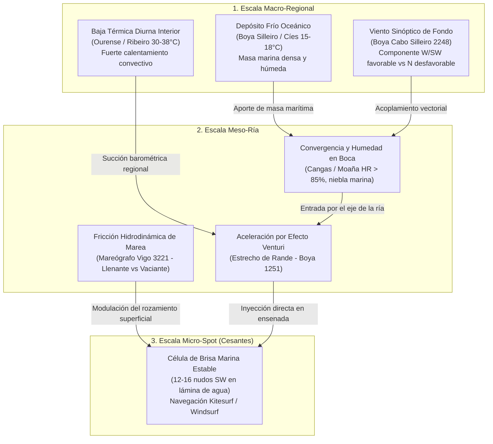
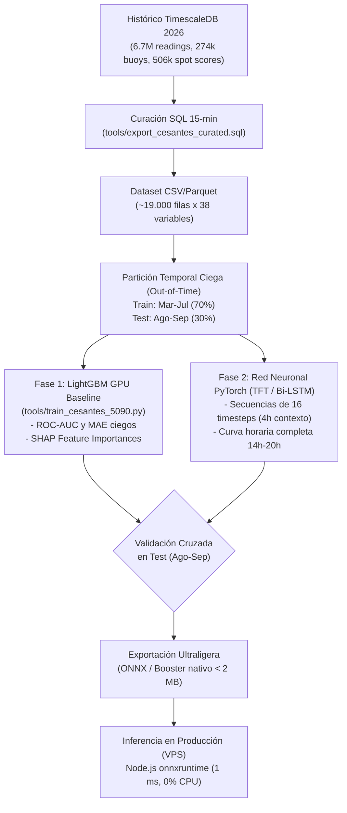

# Hipótesis y Arquitectura del Modelo Predictor de Viento Térmico en Cesantes (MeteoMapGal ML v1)

Documento técnico de formulación física, ingeniería de datos, estrategia de modelado en estación de trabajo local (**NVIDIA GeForce RTX 5090 32 GB VRAM + 128 GB RAM DDR5**) y despliegue a coste cero en producción sobre TimescaleDB y Node.js.

---

## 1. Justificación y Planteamiento del Problema

### 1.1. La Falla Estructural de las Estaciones Terrestres
En la Ensenada de San Simón (Praia de Cesantes, Ría de Vigo):
* **No existe ninguna estación meteorológica física flotante sobre la lámina de agua**.
* Las estaciones oficiales de referencia más próximas (Redondela `mg_10154`, Reboreda `wu_IREDON16`, O Viso, Peinador) están ubicadas en tierra, tras masas de arbolado, colinas y edificios.
* **La rugosidad superficial ($z_0$):** La fricción del terreno decae drásticamente el viento medio a 10 metros de altura en tierra, provocando que midan **4–5 nudos (CALMA)** mientras que en la ensenada soplan **12–16 nudos reales** con decenas de cometas de kitesurf y tablas de windsurf navegando a toda velocidad.
* **La firma de la racha:** Las rachas registradas por los anemómetros terrestres (12–14 nudos) sí rompen la capa límite de fricción desde alturas superiores. Esto demuestra que la masa de aire en movimiento existe en la vertical, aunque la media en superficie terrestre quede artificialmente atenuada.

### 1.2. El Límite de las Reglas Heurísticas Condicionales (IF/THEN)
Los detectores heurísticos basados en umbrales fijos presentan fallos de discontinuidad (*knife-edge boundary collapse*):
* Si una condición exige `viento_medio >= 5 kt` y la estación terrestre oscila entre 4.7 y 5.1 kt, el avisador colapsa a "CALMA", desconectando las alertas en plena tarde de navegación.
* Si se intenta forzar la racha multiplicando linealmente por el boost de la media ($13 \times 2.8$), se producen aberraciones físicas (37 nudos mostrados en pantalla durante una brisa veraniega apacible).
* **Conclusión:** Las reglas fijas no logran capturar la interacción no lineal de 15 variables simultáneas (sol interior, marea, gradiente de humedad, viento atlántico exterior, gradiente térmico de la ría). Se requiere un **modelo probabilístico no lineal de Machine Learning**.

---

## 2. La Hipótesis Termodinámica Central: Macro $\rightarrow$ Micro

El viento térmico en Cesantes **no es un fenómeno estrictamente local**, sino una **máquina térmica regional** acoplada entre el Océano Atlántico y la cuenca interior de Galicia:



### Factores Físicos que Integran la Ecuación del Modelo:
1. **Gradiente Térmico Interior vs Agua ($\Delta T_{\text{macro}}$):**
   $$\Delta T_{\text{macro}} = T_{\text{Ourense}} - T_{\text{Agua Ría}}$$
   En días de verano tardío (ej. 21 de septiembre), Ourense alcanza 30–33°C mientras el agua en Rande/Cíes se sitúa en 17–19°C ($\Delta T \ge 12^\circ\text{C}$). Este gradiente crea una discontinuidad de presión horizontal que succiona el aire marítimo hacia el este.
2. **Gradiente Costa vs Agua ($\Delta T_{\text{local}}$):**
   $$\Delta T_{\text{local}} = T_{\text{Vigo/Peinador}} - T_{\text{Agua}}$$
   Refleja la rampa de temperatura inmediata que activa la brisa a escala costera.
3. **Rampa Solar Diurna Precursora ($d\text{Rad}/dt$):**
   La tasa de incremento de radiación solar entre las 10:30 y las 14:00 local ($>400\text{ W/m}^2$) precede a la convección interior y sirve de variable de predicción temprana (*early warning* con 2 a 3 horas de antelación).
4. **Gradiente de Humedad Boca vs Interior ($\Delta HR$):**
   Humedades altas en Moaña/Cangas ($>80\%$) junto con aire seco en el interior ($<45\%$) delatan la masa de advección marina cargada lista para canalizarse.
5. **Tendencia Barométrica a 3 horas ($\Delta P_{3h}$):**
   La caída barométrica diurna en el valle interior frente a la estabilidad barométrica costera.
6. **Fricción por Corriente de Marea ($d\text{SeaLevel}/dt$):**
   La marea llenante (subiendo hacia Redondela) acompaña al flujo de aire SW, alisando el agua y facilitando el planeo; la marea vaciante genera choque contra la corriente y frena la capa límite.
7. **Componentes Vectoriales $U/V$ en el Atlántico Exterior (Silleiro 2248):**
   Si el viento en océano abierto es Norte ($N > 12\text{ kt}$), destruye la célula de brisa; si es SW suave ($4-10\text{ kt}$), entra en resonancia y canaliza con máxima fuerza.

---

## 3. La Trampa del "Ground Truth" y la Variable Objetivo (Target)

> [!CAUTION]
> **Peligro de Fuga de Sesgo (Garbage In $\rightarrow$ Garbage Out):**
> Si entrenamos el modelo para predecir `readings.wind_speed` de la estación de tierra de Redondela, la IA aprenderá a predecir la calma apantallada de los árboles (4 nudos) y jamás avisará del térmico navegable.

### Formulación del Target Sintetizado:
Para entrenar con rigor científico, se sintetizan dos variables objetivo a $T+1h$, $T+2h$ y $T+3h$:

#### Variable 1: Clasificación de Día Navegable ($Y_{\text{clf}} \in \{0, 1\}$)
Un intervalo temporal se etiqueta como **Térmico Activo ($Y_{\text{clf}} = 1$)** si cumple cualquiera de las siguientes evidencias físicas:
1. Las rachas locales medidas en Redondela superan los **12 nudos** con dirección **SW** ($200^\circ \le \theta \le 270^\circ$) en conjunción con $\Delta T_{\text{macro}} \ge 6^\circ\text{C}$.
2. El registro histórico de evaluaciones del spot (`spot_scores.verdict`) confirmó estado **`BUENO`** (validado por usuarios/bot).
3. La boya de Rande registraba viento efectivo sobre el agua $\ge 11\text{ kt}$.

#### Variable 2: Regresión de Intensidad en Lámina de Agua ($Y_{\text{reg}} \in [0, 25]\text{ kt}$)
Predice la velocidad media real sobre el agua, acotada físicamente entre 10 y 18 nudos para brisas térmicas habituales (impidiendo sobre-escalados irreales de 37 nudos).

---

## 4. Pipeline de Entrenamiento en la NVIDIA RTX 5090

### 4.1. Hardware Local Disponible
* **GPU:** NVIDIA GeForce RTX 5090 (32.607 MiB VRAM Blackwell, TDP 600W, CUDA 13.4, núcleos Tensor FP8/FP16/BF16).
* **CPU / RAM:** 128 GB RAM DDR5 (permite albergar en memoria RAM todo el histórico de TimescaleDB sin necesidad de paginar en disco).
* **Rendimiento:** 18.900 intervalos temporales de 15 minutos se procesan en Polars en $<100\text{ ms}$. El entrenamiento de 500 árboles LightGBM con aceleración GPU tarda **$<3\text{ segundos}$**.

### 4.2. Estrategia de Dos Fases



---

## 5. Protocolo de Validación Temporal Ciega (*Out-of-Time*)

Para evitar el sobreajuste (*overfitting*) y fugas hacia el futuro (*lookahead bias*):
* **Conjunto de Entrenamiento:** 7 de marzo de 2026 $\rightarrow$ 31 de julio de 2026.
* **Conjunto de Evaluación Ciega:** 1 de agosto de 2026 $\rightarrow$ 21 de septiembre de 2026.
  * *Nota crítica:* Este periodo de prueba incluye los días de calor extremo tardío de septiembre a 30–33°C donde los detectores de reglas fijas sufrieron mayor inestabilidad.

### Criterios de Éxito:
* **Clasificación:** $\text{ROC-AUC} \ge 0.88$, $\text{F1-Score} \ge 0.82$, $\text{Brier Score} \le 0.12$.
* **Regresión:** $\text{MAE} \le 1.8\text{ nudos}$ (frente al error habitual del modelo numérico WRF que ronda los 3.5 nudos en la ría).
* **Falsas Alarmas:** Tasa de falsos positivos $<7\%$ en días de calma o bruma marina fría sin gradiente térmico.

---

## 6. Despliegue en Producción a Coste Cero

| Parámetro | Enfoque Descartado (LLM / GPU remota) | Enfoque Implementado (MeteoMapGal ML v1) |
| :--- | :--- | :--- |
| **Entrenamiento** | Servidores cloud de pago ($$$) | **Local en RTX 5090 + 128 GB RAM (0 €)** |
| **Formato del Modelo** | Pesos masivos (GGUF / PyTorch 5 GB) | **ONNX / LightGBM nativo (<2 MB)** |
| **Ejecución en VPS** | Requiere GPU dedicada o API externa | **CPU VPS normal mediante Node.js (<1-2 ms)** |
| **Consumo de Memoria** | >8 GB RAM | **<15 MB RAM** |
| **Latencia** | 1.500 – 3.000 ms | **1 – 2 ms** |
| **Coste Operativo** | Factura mensual en APIs / GPU | **0 € mensuales para siempre** |

---

## 7. Guía Práctica de Ejecución Paso a Paso

### Paso 1: Volcar el Dataset Curado en el Servidor de Base de Datos (`meteomapdb`)
Conéctate por SSH a `root@meteomapdb:~#` y ejecuta:
```bash
cd /opt/MeteoMapGal
git pull origin master
sudo -u postgres psql -d meteomapgal -f tools/export_cesantes_curated.sql -A -F ',' | gzip > /tmp/cesantes_curated_2026.csv.gz
ls -lh /tmp/cesantes_curated_2026.csv.gz
```
*(El archivo pesará aproximadamente entre 2 y 5 MB comprimido).*

### Paso 2: Descargar el Archivo a tu PC Local con la 5090
Desde una terminal PowerShell o Git Bash en tu PC local:
```powershell
scp root@<IP_DEL_SERVIDOR_DB>:/tmp/cesantes_curated_2026.csv.gz "e:\test IA\Meteomapgal_gemini\"
```
Y descomprímelo con 7-Zip, gzip o directamente en Python.

### Paso 3: Instalar Dependencias en tu PC Local
En tu entorno de Python local (con CUDA 12.x / 13.x habilitado):
```bash
pip install polars lightgbm scikit-learn matplotlib pyarrow
```

### Paso 4: Lanzar el Entrenamiento en la RTX 5090
```bash
cd "e:\test IA\Meteomapgal_gemini"
python tools/train_cesantes_5090.py --data cesantes_curated_2026.csv
```

### Paso 5: Interpretar los Resultados
El script mostrará en consola:
1. Número de muestras de entrenamiento (Mar-Jul) y test ciego (Ago-Sep).
2. Métrica **ROC-AUC** de acierto en detección de térmico.
3. Métrica **MAE** (error medio en nudos de viento).
4. El **Top 12 de variables físicas** que gobiernan el viento en Cesantes según los árboles de decisión.
5. Exportación automática de los ficheros de modelo `cesantes_thermal_classifier.txt` y `cesantes_wind_regressor.txt`.
